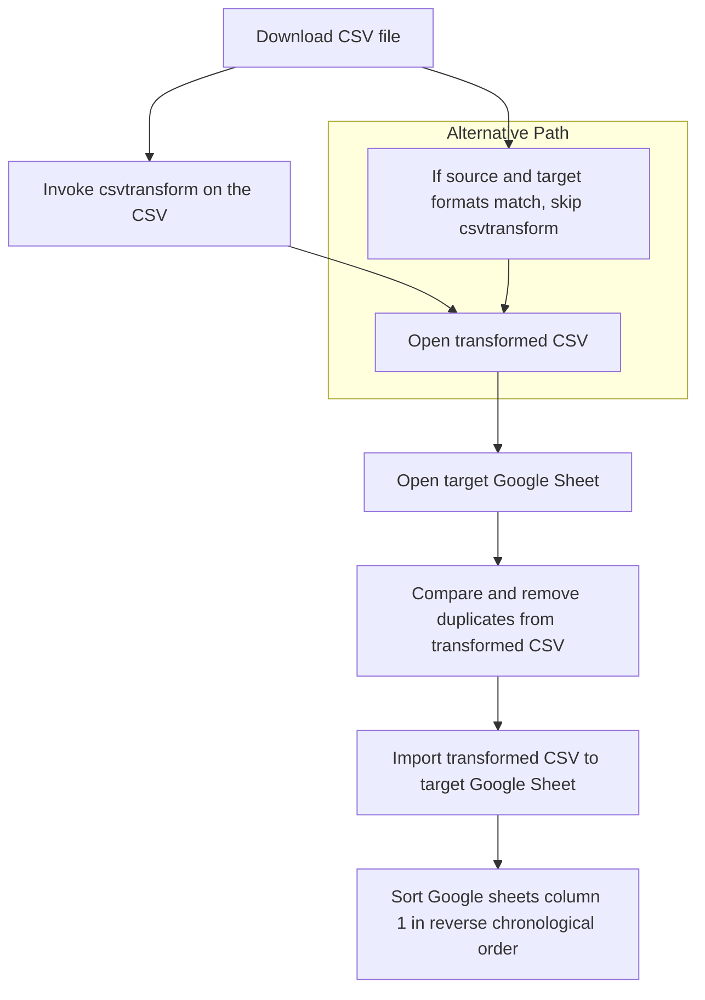

# CSV Import Workflow

```mermaid
flowchart TD
    A[Download CSV file] --> B[Invoke csvtransform on the CSV]
    B --> C[Open transformed CSV]
    C --> D[Open target Google Sheet]
    D --> E[Compare and remove duplicates from transformed CSV]
    E --> F[Import transformed CSV to target Google Sheet]
    F --> G[Sort Google sheets column 1 in reverse chronological order]
    subgraph Alternative Path
        H[If source and target formats match, skip csvtransform]
        H --> C
    end
    A --> H
```

This chart visualizes the process for importing and transforming CSV files for multiple organizations, including duplicate removal and Google Sheets integration.