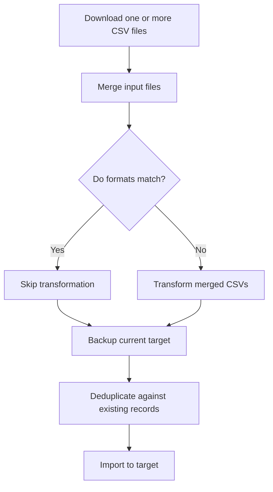

# CSV Import Workflow

This chart visualizes the process for importing and transforming multiple CSV files for organizations, including merging, deduplication, automated backup, and integration with the target data store.

**Key workflow updates:**

- Use `--input-files` to specify a comma-separated list of CSVs to merge and process.
- Before any update, the current target data store is backed up to `backups/` with a timestamped filename.
- Deduplication compares merged input data against the latest records in the target data store.
- Data is imported and sorted in the target data store.