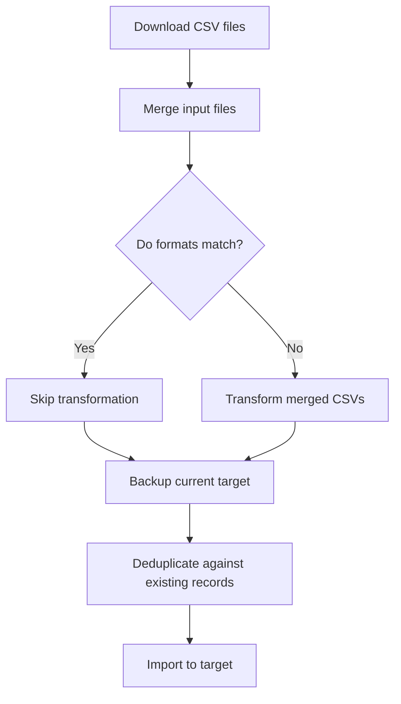

# csvimport Documentation

## Overview

`csvimport.py` is a robust, configurable tool for importing, transforming, deduplicating, and uploading CSV data to a target data store (such as Google Sheets). It supports organization-specific formats, multi-file input, backup/DR, and advanced mapping features.

## Features

- Organization-specific input/output formats via config file
- Multi-file CSV merging
- Deduplication against existing records

- Category field mapping (planned)
- Logging and error handling
- Testable with pytest

## Usage

### Command Line Options

```
python csvimport.py --input-files <csv1,csv2,...> --org <org> [--config <config>] [--output <output.csv>] [--dry-run]
```

- `--input-files`: Comma-separated list of CSV files to merge and process
- `--org`: Organization name for config lookup
- `--config`: Path to config file (default: confs/csvimport.conf)
- `--output`: Optional output CSV file
- `--dry-run`: Preview changes without modifying the target data store

```

## Configuration

The config file (`confs/csvimport.conf`) defines formats and rules per organization:

```yaml
organizations:
  nfcu:
    input_format: [ ... ]
    output_format: [ ... ]
    key_fields: [ ... ]
    sheet_name: "nfcutest"
    category_map:
      "OldCategory": "NewCategory"
```

- `input_format`/`output_format`: List of columns for import/export
- `key_fields`: Used for deduplication
- `category_map`: (planned) Maps imported category values to desired values

## Workflow



## Testing

- Tests are located in `tests/`
- Run with `pytest`
- Coverage reporting with `pytest-cov` (optional)

## Planned Features

- Dry-run option
- Organization-specific category mapping

## Mermaid Workflow Diagram

See `docs/csvimport.md` for a visual workflow.

## Authors & Contributors

- Vincent Miller
- ...

## License

MIT

## Changelog

- See PRs and commit history for details.
